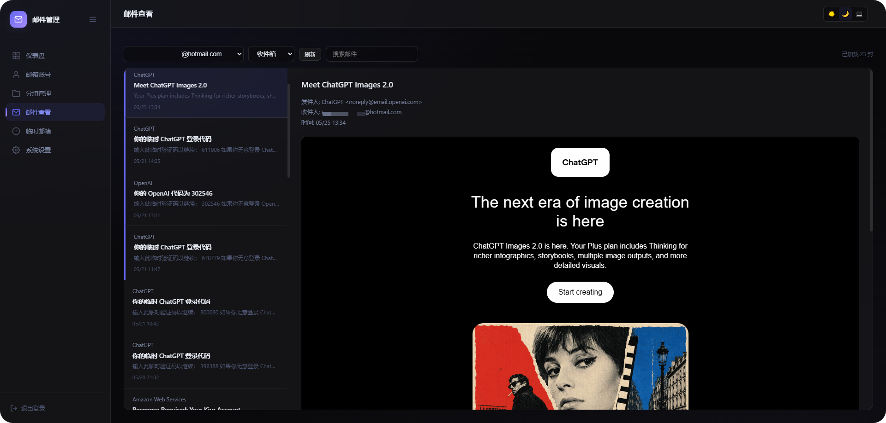

# Outlook Email Manager

<div align="center">

**Lightweight Outlook email manager powered by Cloudflare Workers**

100% Free · No Server Required · Global CDN · Dark/Light Theme

[](https://deploy.workers.cloudflare.com/?url=https://github.com/roseforyou/cf-outlook-email)

[中文](./README.md) · [Deployment Guide](./docs/GUIDE.md)

</div>

---



## Features

- **One-Click OAuth** — Authorize Outlook accounts via browser popup, no manual token copying
- **Auto Token Refresh** — Automatically saves new refresh tokens on each use, preventing expiry
- **Batch Operations** — Import/export/delete/move accounts in bulk with group & status filters
- **Email Reading** — Read inbox via Microsoft Graph API with search and HTML rendering
- **Temp Email** — GPTMail API integration for disposable email addresses
- **Theme Switching** — Dark / Light / Auto with glassmorphism UI
- **Completely Free** — Runs on Cloudflare's free tier, no credit card needed

## Quick Deploy

```bash
# 1. Clone & install
git clone https://github.com/roseforyou/cf-outlook-email.git
cd cf-outlook-email
pnpm install

# 2. Login to Cloudflare
pnpm exec wrangler login

# 3. Create D1 database (copy database_id to wrangler.toml)
pnpm exec wrangler d1 create outlook-email-db
cp wrangler.toml.example wrangler.toml
# Edit wrangler.toml, replace REPLACE_WITH_YOUR_DATABASE_ID

# 4. Set secrets
pnpm exec wrangler secret put ADMIN_PASSWORD
pnpm exec wrangler secret put COOKIE_SECRET

# 5. Initialize & deploy
pnpm exec wrangler d1 migrations apply outlook-email-db --remote
pnpm exec wrangler deploy
```

Visit the output URL and login with your password.

## Adding Accounts

Login → **Add Account** → **One-Click Auth** → Microsoft login popup → Authorize → Credentials auto-filled → Save.

Works with all Outlook / Hotmail / Live accounts. Bulk import supported (format: `email----password----client_id----refresh_token`).

## Tech Stack

| Layer | Technology |
|-------|-----------|
| Runtime | Cloudflare Workers (TypeScript) |
| Router | Hono |
| Database | Cloudflare D1 (SQLite) |
| Frontend | Vanilla HTML/CSS/JS |
| Email | Microsoft Graph API |
| Deploy | Wrangler |

## Free Tier Limits

| Resource | Free Quota | Sufficient? |
|----------|-----------|:-----------:|
| Worker Requests | 100K/day | ✅ |
| CPU Time | 10ms/req | ✅ |
| Subrequests | 50/req | ✅ (single account per request) |
| D1 Storage | 5 GB | ✅ |

## Disclaimer

This project is intended for personal use to manage your own email accounts. Ensure you have legal authorization for all accounts you manage. The default Client ID is Mozilla Thunderbird's public ID for quick setup only — registering your own Azure app is recommended for production use. The author assumes no liability for any misuse.

## Credits

This project is a rewrite of [xiaozhi349/outlookEmail](https://github.com/xiaozhi349/outlookEmail), originally built with Python Flask + SQLite. It has been migrated to Cloudflare Workers + D1 with a completely new frontend and backend. Thanks to the original author.

## License

[GPL-3.0](./LICENSE)

Free to use, modify, and distribute.
